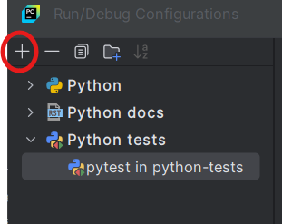

# python-tests

This branch contain all practices session of the Udemy course entitled Unit testing and Test Driven Development(TDD) in Python

THE TEST ON THIS BRANCH WILL USE TDD (Test Driven Development) STRUCTURE

Get Started
Install pytest
pytest requires: Python 3.8+ or PyPy3.

Run the following command in your command line:

`pip install -U pytest`
Check that you installed the correct version:

`$ pytest --version`
pytest 8.3.4

You can use the `assert` statement to verify test expectations

# Create your first test
File tests must start with test_ or end in _test.py
Create a new file called test_sample.py, containing a function, and a test:

# content of test_sample.py
```python
    def func(x):
        return x + 1

    def test_answer():
        assert func(3) == 5
```
The test

$ pytest
=========================== test session starts ============================
platform linux -- Python 3.x.y, pytest-8.x.y, pluggy-1.x.y
rootdir: /home/sweet/project
collected 1 item

test_sample.py F                                                     [100%]

================================= FAILURES =================================
_______________________________ test_answer ________________________________

    def test_answer():
>       assert func(3) == 5
E       assert 4 == 5
E        +  where 4 = func(3)

test_sample.py:6: AssertionError
========================= short test summary info ==========================
FAILED test_sample.py::test_answer - assert 4 == 5
============================ 1 failed in 0.12s =============================
# Run all tests in terminal
For that, you may use the following command :

1. `pytest -v -s` : run all tests
2. `pytest -v -s test_file.py` : run tests in test_file.py only
3. `pytest -v -s test_directory/` : run tests within the test_directory
4. `pytest -v -s -k "test2"` : run tests where we have the key word 'test2'
5. `pytest -v -s -k "test2 or test3"` : run tests where we have the key word 'test2' or 'test3'
6. `pytest -v -s -q` : run tests quite mode, it can be helpful when running hundreds or thousands of tests at once.  

# Run tests in pycharm (Set pytest as the Default Test Runner in PyCharm)
1. Go to Run → Edit Configurations.

  


2. Click the + button (top-left corner) and select Python Tests → pytest.
3. In the Script path, select your test file or directory.
4. In the Additional Arguments field, enter : `-v`
5. Click Apply and OK.


# Run multiple tests
pytest will run all files of the form test_*.py or *_test.py in the current directory and its subdirectories. More generally, it follows standard test discovery rules.


# Group multiple tests in a class
Once you develop multiple tests, you may want to group them into a class. pytest makes it easy to create a class containing more than one test:

# content of test_class.py
```python
class TestClass:
    def test_one(self):
        x = "this"
        assert "h" in x

    def test_two(self):
        x = "hello"
        assert hasattr(x, "check")
```
pytest discovers all tests following its Conventions for Python test discovery, so it finds both test_ prefixed functions. There is no need to subclass anything, but make sure to prefix your class with Test otherwise the class will be skipped. 